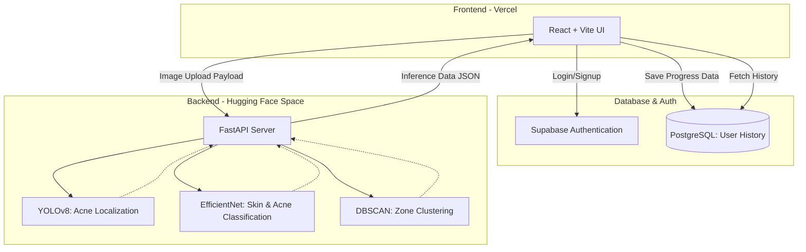

# 🌟 SkinMate — AI-Powered Skincare Companion 🧴


> **An advanced AI-powered skincare companion that utilizes Computer Vision to analyze skin types, detect acne severity, and provide personalized skincare recommendations.**
> _Built as a Computer Vision university final project! 🚀_
>
>
> **🌟 Live Demo:** [**SkinMate Web App**](https://skinmateai.vercel.app/) | [**AI Inference API**](https://huggingface.co/spaces/midoo012/skincare-vision-api/tree/main)

_Disclaimer: SkinMate is an educational AI research project designed to support skincare awareness using Computer Vision. It is **not a medical device** and cannot replace professional advice, diagnosis, or treatment from a certified dermatologist._

## 📖 Project Overview

SkinMate bridges the gap between artificial intelligence and personal dermatological care. By simply uploading a photo or using a live camera feed, the system provides a detailed assessment of the user's skin condition. It visualizes problem zones, classifies acne types, and generates dynamic, ingredient-focused skincare routines.

_Note: Due to the large size of the PyTorch and YOLOv8 models, this repository exclusively hosts the **Frontend Application**. The core AI inference engine and Backend API are hosted and maintained separately on **Hugging Face Spaces**._

## ✨ Key Features

- **🧑‍⚕️ Skin Type Classification:** Automatically detects whether skin is Dry, Oily, or Normal using a fine-tuned EfficientNet model.
- **🔍 Acne Detection & Classification:** Leverages YOLOv8 to localize blemishes and EfficientNet to classify them into specific types (Comedo vs. Inflamed).
- **🗺️ Zone Clustering:** Utilizes the DBSCAN algorithm to group nearby acne detections, effectively visualizing "Inflamed Zones" versus "Comedo Zones".
- **📝 Personalized Skincare Tips:** Generates dynamic, science-backed skincare recommendations based on the unique combination of the user's skin type and acne severity.
- **📈 Progress Tracking & Comparison:** Saves scan histories locally to visualize skin improvement over time via interactive charts, including a side-by-side visual skin comparison tool.

## 📐 System Architecture



## 🤝 My Role & Contributions

In this collaborative group project, my core responsibility was architecting the **Artificial Intelligence Engine and Backend API**. My specific contributions include:

- **Computer Vision Modeling:** Trained and integrated **YOLOv8** for high-precision acne localization, and engineered **EfficientNet** pipelines to classify both overall skin types and specific blemish categories.
- **Advanced Data Processing:** Implemented the **DBSCAN** clustering algorithm using Scikit-learn and OpenCV to intelligently group isolated acne into actionable problem zones.
- **Backend API Development:** Designed and built the complete backend architecture using **FastAPI**, creating robust RESTful endpoints to process frontend image payloads and return complex inference data.
- **Cloud Deployment:** Packaged the AI models and FastAPI backend using Docker and successfully deployed the inference engine directly to **Hugging Face Spaces**.

## 🛠️ Technology Stack

**Backend & AI (My Contribution - Hosted on Hugging Face)**

- **Python 3** 🐍
- **YOLOv8** 🎯 (Object Detection & Localization)
- **PyTorch & EfficientNet** 🧠 (Deep Learning Classification)
- **OpenCV & Scikit-learn** 👁️ (Image Processing & DBSCAN Clustering)
- **FastAPI** 🚀 (REST API Architecture)

**Frontend (This Repository)**

- **React (Vite) & TypeScript** ⚛️
- **CSS** 🎨 (Custom modular styles)
- **Recharts** 📊 (For progress tracking visualization)
- Supabase 🗄️ (PostgreSQL Database & User Authentication)

## 📂 Project Structure (Frontend)

```text
├── public/                 # Static assets
├── src/                    # React frontend source code (components, pages, hooks, styles)
├── .env.example            # Environment variable templates
├── .gitignore              # Git ignore rules
├── index.html              # Main HTML entry point
├── package.json            # Node.js dependencies and scripts
├── vite.config.ts          # Vite configuration
└── README.md               # Project documentation
```

## 💻 Running Locally

### Frontend Setup

1. Clone this repository and navigate to the project directory:
   ```bash
   git clone https://github.com/yosukeyung/SkinMate
   cd SkinMate
   ```
2. Install dependencies:

   ```bash
   npm install
   ```

3. Set up your environment variables by copying .env.example to .env:

   ```bash
   cp .env.example .env
   ```

4. Inside the .env file, link the frontend to the Hugging Face Space API:

   ```bash
   VITE_BACKEND_URL=https://YOUR_HF_USERNAME-YOUR_HF_SPACE_NAME.hf.space
   VITE_SUPABASE_URL=YOUR_SUPABASE_URL
   VITE_SUPABASE_ANON_KEY=YOUR_SUPABASE_ANON_KEY
   ```

5. Start the development server:
   ```bash
   npm run dev
   ```

## 🌐Deployment Architecture

- Frontend: Seamlessly deployed to Vercel utilizing the Vite framework preset.

- Database: Supabase acts as the cloud database and authentication provider.

- Backend: Hosted on Hugging Face Spaces utilizing Docker and FastAPI to efficiently handle heavy PyTorch tensor computations and computer vision inferences in the cloud.

## 👨‍💻 Author

Yosuke Yung
CS Student @ BINUS UNIVERSITY
